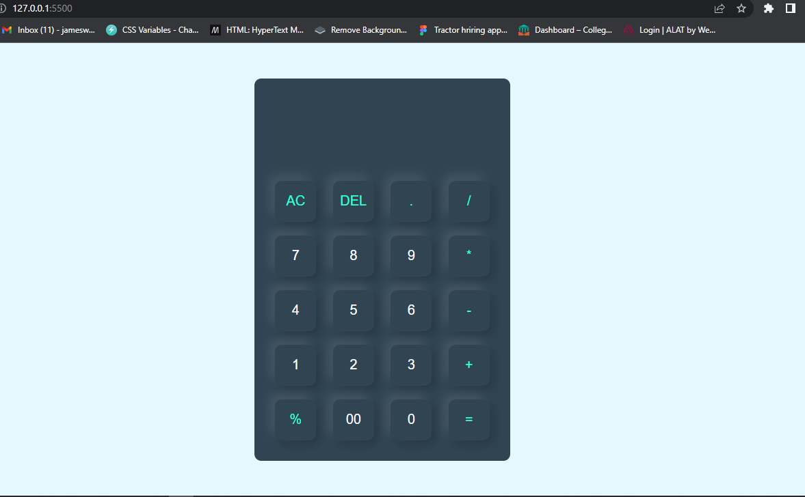

# Javascript101 - NHUb Nigeria, Jos,  Plateau state.
This calculator is a basic web-based calculator that allows you to perform arithmetic operations such as addition, subtraction, multiplication, and division. It has a simple user interface where you can input numerical values and perform calculations. The calculator also includes additional functionalities such as clearing the display (`AC` button), deleting the last entered digit (`DEL` button), adding a decimal point (`.` button), and calculating percentages (`%` button). 
You can perform calculations by clicking the respective buttons or by using your keyboard. The result of the calculation is displayed in real-time on the input field. It provides a convenient way to perform simple mathematical calculations within a web browser.
## Screenshot

### Links 
- solution URl: [https://github.com/Wandiya/Javascript101](https://github.com/Wandiya/Javascript101)
-Live site URL: [https://wandiya.github.io/Javascript101/] (https://wandiya.github.io/Javascript101/)

### Built with 
- HTML 
-CSS
-Javascript

### what I learned
functions and objects 

### Useful resources

-Youtube tutorials

### Author 
- Frontend Mentor - [@wandiya](https://www.frontendmentor.io/home)
- Twitter - [@wandiyaJames](https://twitter.com/home)
- LinkedIn - [https://www.linkedin.com/in/james-wandiya-87b90912a]

### Acknowledgments
I James Wandiya acknowledge that this work has been implemented through hardwork and dedication. I am deeply indebted to Mr Charles (My  Instructor) Backend Mentor and fellow colleagues at Nhub Nigeria.
